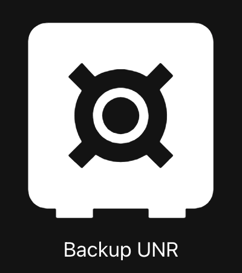

# UniFi Network Rules

[![License][license-shield]](LICENSE)
![Project Maintenance][maintenance-shield]
[![GitHub Activity][commits-shield]][commits]

[![GitHub Release][release-shield]][releases]
[![issues][issues-shield]][issues-link]
[![validate-badge]][validate-workflow]

[](https://www.buymeacoffee.com/sirkirby)

UniFi Network Rules is a custom integration for Home Assistant that integrates with your UniFi Dream Machine/Router to both provide and help you create useful interactions and automations for your Home Lab. The goal of this integration is to simplify policy and rule management for real world use cases. I built this because I wanted to enable things like screen time controls for my kids, game server access controls, and more with the push of a button in Home Assistant. Functionality that can be shared with anyone in your home.

## Features

- Switch entities for all rules, including firewall policies (zone-based firewall), traffic/firewall rules (non-zone-based firewall), forwarding rules, traffic routes.
- VPN management including both client and server configurations for OpenVPN and WireGuard.
- Service actions for full backup and restore of all rules that are managed by this integration.
- Service actions for batch enabling and disabling rules by pattern matching rule names or IDs.
- Service actions for deleting rules by ID.

Request a feature [here](https://github.com/sirkirby/unifi-network-rules/issues).

## Requirements

- A UniFi device running network application 9.0.92 or later.
- A local account with Admin privileges to the network application. Must not be a UniFi Cloud account.
- Home Assistant 2025.2 or later with network access to the UniFi device.

## Installation

[](https://my.home-assistant.io/redirect/hacs_repository/?owner=sirkirby&repository=UniFi-network-rules&category=integration)

[![hacs][hacsbadge]][hacs]
[![Discord][discord-shield]][discord]
[![Community Forum][forum-shield]][forum]

If you don't or can't use HACS, alternatively, copy the `custom_components/unifi_network_rules` directory to your `config/custom_components` directory.

I recommend installing the Studio Code Server addon to make it easier to copy in the custom component directly in the Home Assistant UI. `Settings -> Add-ons -> Studio Code Server -> Install`. Then turn on `Show in Sidebar`.

THEN

1. Restart Home Assistant.
2. In the Home Assistant configuration page, click on "Integrations".
3. Click on the "+" button in the bottom right corner.
4. Search for "UniFi Network Rule Manager" and select it.
5. Enter credentials of a local admin user on your UDM and click on the "Submit" button.

## Configuration

**Host**: The IP address or hostname of your UniFi Device.

**Username**: The local admin account on the UDM.

**Password**: The password for the UDM account.

**Site**: The UniFi site name to connect to (defaults to "default" if not specified).

**Update Interval**: The automatic refresh interval in minutes. Can be longer since updates real-time.

**Verify SSL**: Enable SSL certificate verification (defaults to disabled for self-signed certificates).

## Usage

Once you have configured the integration, you will be able to see the policies, rules, and routes configured on your UniFi Network as switches in Home Assistant. Add the switch to a custom dashboard or use it in automations just like any other Home Assistant switch.

## Services

The integration provides several services focused on managing and automating existing UniFi Network rules:

### Getting Started with Services

There are two main ways to use these services in Home Assistant:

#### Method 1: Using an Input Button Helper with Automation

This is the simplest method:

1. Go to Settings → Devices & Services → Helpers
2. Add a Button helper (e.g., "Refresh UniFi Rules")
3. Create an automation that triggers when the button is pressed
4. Use the service in the automation's action

Example automation for refresh:

```yaml
alias: Backup UniFi Network Rules
description: >-
  Dumps all policy, rule, and route JSON state to a file in the ha config
  directory
triggers:
  - trigger: state
    entity_id:
      - input_button.backup_unr
conditions: []
actions:
  - action: unifi_network_rules.backup_rules
    metadata: {}
    data:
      filename: unr_daily_backup.json
mode: single
```



#### Method 2: Using Scripts with a Lovelace Button Card (More Customizable)

First, create a script in your Settings → Automations & Scenes → Scripts:

```yaml
sequence:
  - sequence:
      - action: unifi_network_rules.backup_rules
        metadata: {}
        data:
          filename: my_custom_unr_backup.json
alias: Backup my UniFi Rules
description: Custom script that will backup all rules and routes imported from your UDM
```

Then add a button card to your dashboard that references the script:

```yaml
show_name: true
show_icon: true
type: button
tap_action:
  action: perform-action
  perform_action: script.backup_my_unifi_rules
  target: {}
name: Backup my Network Rules
icon: mdi:cloud-upload
```

### Services Reference

| Service | Description | Parameters |
|---------|-------------|------------|
| `unifi_network_rules.refresh_rules` | Manually refresh all network rules from the UniFi controller | None |
| `unifi_network_rules.backup_rules` | Create a backup of all firewall policies and traffic routes | `filename`: Name of the backup file to create |
| `unifi_network_rules.restore_rules` | Restore rules from a backup file | `filename`: Backup file to restore from<br>`name_filter`: (Optional) Only restore rules containing this string<br>`rule_ids`: (Optional) List of specific rule IDs to restore<br>`rule_types`: (Optional) List of rule types to restore (policy, port_forward, route, qos_rule) |
| `unifi_network_rules.bulk_update_rules` | Enable or disable multiple rules by name pattern | `state`: true (enable) or false (disable)<br>`name_filter`: String to match in rule names |
| `unifi_network_rules.delete_rule` | Delete an existing firewall policy by ID | `rule_id`: ID of the rule to delete |
| `unifi_network_rules.refresh_data` | Refresh data for a specific integration instance or all | `entry_id`: (Optional) Specific integration instance ID |
| `unifi_network_rules.reset_rate_limit` | Reset API rate limiting if you hit request limits | None |
| `unifi_network_rules.websocket_diagnostics` | Run diagnostics on WebSocket connections and try to repair if needed | None |
| `unifi_network_rules.force_cleanup` | Force cleanup of all entities in the integration | None |
| `unifi_network_rules.force_remove_stale` | Force removal of stale or broken entities | `remove_all`: (Optional) Remove all entities instead of just stale ones |
| `unifi_network_rules.apply_template` | Apply a predefined rule template | `template_id`: ID of the template to apply<br>`variables`: (Optional) Variables to use in the template |
| `unifi_network_rules.save_template` | Save a rule as a template for reuse | `rule_id`: ID of the rule to save<br>`template_id`: ID to save the template as<br>`rule_type`: (Optional) Type of rule |
| `unifi_network_rules.toggle_rule` | Toggle a specific rule on or off | `rule_id`: ID of the rule to toggle<br>`rule_type`: Type of the rule |

> **Note**: For `rule_types` parameter, you can specify one or more of: `policy` (zone-based firewall rules), `port_forward` (port forwarding rules), `route` (traffic routes), or `qos_rule` (quality of service rules). See the "Understanding Rule Types" section for more details.

## Automation Examples

### Automated Daily Backup

```yaml
alias: Backup UniFi Network Rules
description: >-
  Creates a daily backup of all policy, rule, and route JSON state to a file in 
  the Home Assistant config directory every day at 2:00 AM
triggers:
  - trigger: time_pattern
    hours: "2"
conditions: []
actions:
  - action: unifi_network_rules.backup_rules
    metadata: {}
    data:
      filename: unr_daily_backup.json
mode: single
```

### Full and Selective restore

Fully restore the state of all policies

```yaml
alias: Restore all policies from last backup
description: Restores the backed-up state of all policies, including zones, devices, objects, etc.
triggers:
  - trigger: state
    entity_id:
      - input_button.restore_unr
conditions: []
actions:
  - action: unifi_network_rules.restore_rules
    metadata: {}
    data:
      filename: unr_daily_backup.json
mode: single
```

Selectively restore rules based on name and type

```yaml
alias: Restore Kid Downtime Policies
description: Restores the backed-up state of the policies that contain the name `Block Kid`
triggers:
  - trigger: state
    entity_id:
      - input_button.restore_unr
conditions: []
actions:
  - action: unifi_network_rules.restore_rules
    metadata: {}
    data:
      filename: unr_daily_backup.json
      name_filter: Block Kid
      rule_types:
        - policy
mode: single
```

### Block Kid's devices at bedtime

Every night at 11PM, Policies or Rules that contain the name "Block Kid Internet" will `enable` and send a notification to Chris's iPhone

```yaml
alias: Daily Device Downtime
description: Block kid devices at bedtime daily
triggers:
  - trigger: time_pattern
    hours: "23"
conditions: []
actions:
  - action: unifi_network_rules.bulk_update_rules
    metadata: {}
    data:
      state: true
      name_filter: Block Kid internet
  - action: notify.mobile_app_chrisiphone
    metadata: {}
    data:
      message: Kids Device Downtime Enabled
      title: Daily Device Downtime
mode: single
```

### Temporarily Enable Game Server Access

```yaml
alias: Turn Off Minecraft Server Port after 2 hours
description: >-
  We don't want to leave this port open indefinitely, just leave open for a
  normal gaming session, then automatically turn off.
triggers:
  - trigger: state
    entity_id:
      - switch.port_forward_minecraft_10_1_1_75_4882
    from: "off"
    to: "on"
conditions: []
actions:
  - delay:
      hours: 2
      minutes: 0
      seconds: 0
      milliseconds: 0
  - action: switch.turn_off
    metadata: {}
    data: {}
    target:
      entity_id: switch.port_forward_minecraft_10_1_1_75_4882
mode: single
```

This automation uses a helper to toggle port forwarding access to a game server. When enabled, it automatically disables the port forwarding after 2 hours for security.

## Tips for Using Services

1. **Backup Organization**: Use descriptive filenames with timestamps:

   ```yaml
   filename: "UniFi_rules_{{now().strftime('%Y%m%d_%H%M')}}.json"
   ```

2. **Selective Restore**: When restoring rules, use filters to target specific rules:

   ```yaml
   action: unifi_network_rules.restore_rules
   data:
     filename: "backup.json"
     name_filter: "Guest"  # Only restore guest-related rules
     rule_types:
       - policy  # Only restore firewall policies
   ```

3. **Bulk Updates**: Use naming conventions in UniFi to make bulk updates easier:
   - Name related rules with common prefixes (e.g., "Guest_", "IoT_")
   - Use the bulk_update_rules service with name_filter to manage groups of rules

4. **Integration with Other Services**: Combine with other Home Assistant integrations:
   - Use the Folder Watcher integration to monitor backup file changes
   - Combine with the Google Drive Backup integration for offsite copies
   - Set up notifications when rule states change

## Understanding Rule Types

The UniFi Network Rules integration supports several types of rules:

1. **Firewall Policies (policy)**: Zone-based firewall rules that control traffic between different security zones (WAN, LAN, Guest, etc.). These form the backbone of your network security.

2. **Port Forwarding Rules (port_forward)**: Allow external traffic to reach specific internal devices and services by forwarding specific ports from your WAN to internal IP addresses.

3. **Traffic Routes (route)**: Control how traffic is routed through your network, typically used for VPN routing or specific network destinations. Each traffic route has two components:
   - The main switch that enables/disables the route
   - A child "kill switch" that blocks all traffic if the route is down (prevents data leakage if your VPN disconnects)

4. **QoS Rules (qos_rule)**: Quality of Service rules that prioritize certain types of traffic on your network. These rules can ensure critical applications (like video conferencing) get bandwidth priority over less time-sensitive applications.

5. **Legacy Rules**: For older UniFi OS versions, there are also legacy_firewall and legacy_traffic rule types, which are mapped to "policy" when using the service.

## Local Development

### Testing

To run the tests, you need to install the dependencies in the `requirements.txt` file.

```bash
python3 -m venv venv
source venv/bin/activate
pip install -r requirements.txt
```

Then run the tests:

```bash
pytest tests
```

### API Testing

We've created a [Bruno](https://github.com/sirkirby/bruno-udm-api) collection to manually test the API requests. These are the same requests that the integration makes. This is a great way to verify your credentials are valid and to verify device connectivity and compatibility.

## Diagnostics and Debugging

The integration includes targeted diagnostics and debugging capabilities to help troubleshoot issues while minimizing resource usage.

### Standard Logging

To enable debug logging for the entire integration, add the following to your `configuration.yaml`:

```yaml
logger:
  logs:
    custom_components.unifi_network_rules: debug
    aiounifi: debug  # Also log the underlying UniFi library
```

### Targeted Debugging

For more focused debugging of specific subsystems, you can enable only what you need by editing the constants in `custom_components/unifi_network_rules/const.py`:

- `LOG_WEBSOCKET`: Enable detailed WebSocket connection and message logs
- `LOG_API_CALLS`: Log API requests and responses
- `LOG_DATA_UPDATES`: Log data refresh and update cycles
- `LOG_ENTITY_CHANGES`: Log entity addition, removal, and state changes

These targeted flags help reduce log noise when troubleshooting specific issues.

### Home Assistant Diagnostics

This integration supports Home Assistant's built-in diagnostics. To access:

1. Go to Settings → Devices & Services → Integrations
2. Find the UniFi Network Rules integration
3. Click on Configure → Download Diagnostics
4. Share the generated file when reporting issues

The diagnostics provide essential information about your system configuration without exposing sensitive data.

### Temporary Websocket Health Monitor

For advanced troubleshooting of connectivity issues, the integration includes a WebSocket health monitor that can help identify connection problems with the UniFi controller.

### Temporary Enable API Call Tracing [Advanced]

To temporarily enable API call tracing for a session:

1. SSH into your Home Assistant instance
2. Enter the `/config/custom_components/unifi_network_rules` directory
3. Edit the file: `const.py`
4. Change `LOG_API_CALLS = False` to `LOG_API_CALLS = True`
5. Restart Home Assistant

*Remember to revert this change after troubleshooting to prevent excessive logging.*

## General Troubleshooting

If you are having trouble getting the integration to work, please check the following:

1. Ensure the UDM is running the latest version of the network application.
2. Ensure the UDM is connected to the same network as your Home Assistant instance.
3. Ensure you are using the IP address of the UDM, not the hostname.
4. Verify your local account has proper admin privileges.

### Verify your local account is working

Run this on a computer connected to the same network as your UDM or directly on your Home Assistant instance to verify connectivity to the UDM and that your credentials are valid.

```bash
curl -k -X POST https://[UDM-IP]/api/auth/login \
-H "Content-Type: application/json" \
-d '{"username":"[USERNAME]","password":"[PASSWORD]"}' 
```

Possible responses:

- 200 OK: Credentials are valid. Returns a JSON object with the user's information.
- 401 Unauthorized: Credentials are invalid.
- 429 Too Many Requests: The user has made too many requests in a short period of time. Wait a few minutes and try again.

### Verify your account has admin privileges

You can do this by logging into your UniFi device locally or via <https://UniFi.ui.com>, navigate to Settings -> Admins & Users, and checking the local user's permissions. It should be Admin or Super Admin for the network application.

### Open a bug issue

If you are having trouble getting the integration to work, please open an [Issue](https://github.com/sirkirby/UniFi-network-rules/issues) using the bug report template. Please enable debug logging and include the full log output in your report. Note that it may contain sensitive network information, so please review it before posting. The logs can be large, so i recommend attaching them as a file.

To get the debug log, navigate Devices and Services -> UniFi Network Rules -> Enable Debug Logging. Then reload the integration and try to reproduce the issue. Finally, disable debug logging and download the log file.

## Limitations

This integration uses the same core library that Home Assistant Unifi integration uses, so there can be version incompatibility issues at time. We may ship with a higher version causing conflicts if you use multiple UniFi integrations. Sometimes restarting Home Assistant can help.

This will not support all the features of the UniFi controller, for that, leverage the core integration. The focus of this integration will be home and home lab use cases to extend and differentiate from the core integration.

## Contributions

Contributions are welcome! Please read our [Contributing Guidelines](CONTRIBUTING.md) and feel free to submit a PR.

***

[commits-shield]: https://img.shields.io/github/commit-activity/y/sirkirby/unifi-network-rules?style=for-the-badge
[commits]: https://github.com/sirkirby/unifi-network-rules/commits/main
[license-shield]: https://img.shields.io/github/license/sirkirby/unifi-network-rules.svg?style=for-the-badge
[maintenance-shield]: https://img.shields.io/badge/maintainer-sirkirby-blue.svg?style=for-the-badge

[hacs]: https://github.com/custom-components/hacs
[hacsbadge]: https://img.shields.io/badge/HACS-Custom-orange.svg?style=for-the-badge
[discord]: https://discord.gg/Qa5fW2R
[discord-shield]: https://img.shields.io/discord/330944238910963714.svg?style=for-the-badge
[forum-shield]: https://img.shields.io/badge/community-forum-brightgreen.svg?style=for-the-badge
[forum]: https://community.home-assistant.io/

[releases]: https://github.com/sirkirby/unifi-network-rules/releases
[release-shield]: https://img.shields.io/github/v/release/sirkirby/unifi-network-rules?style=flat

[issues-shield]: https://img.shields.io/github/issues/sirkirby/unifi-network-rules?style=flat
[issues-link]: https://github.com/sirkirby/unifi-network-rules/issues

[validate-badge]: https://github.com/sirkirby/unifi-network-rules/actions/workflows/test-suite.yml/badge.svg
[validate-workflow]: https://github.com/sirkirby/unifi-network-rules/actions/workflows/test-suite.yml