# Entity Lifecycle and Coordinator Architecture

**Status**: Active  
**Created**: 2025-09-23  
**Author**: @sirkirby, AI assistant  
**Category**: Architecture & Implementation  

## Abstract

This document provides comprehensive documentation of the entity lifecycle and coordinator architecture patterns established through the implementation of static routes support and resolution of critical entity lifecycle bugs. It codifies the proper patterns for entity discovery, creation, deletion, and management within the UniFi Network Rules integration.

## Table of Contents

- [Entity Lifecycle and Coordinator Architecture](#entity-lifecycle-and-coordinator-architecture)
  - [Abstract](#abstract)
  - [Table of Contents](#table-of-contents)
  - [Overview](#overview)
    - [Core Principles](#core-principles)
  - [Integration Startup Lifecycle](#integration-startup-lifecycle)
    - [Startup Phase Details](#startup-phase-details)
      - [1. Coordinator Initialization](#1-coordinator-initialization)
      - [2. Registry Population](#2-registry-population)
      - [3. Initial Data Fetch](#3-initial-data-fetch)
  - [Coordinator Architecture](#coordinator-architecture)
    - [Data Storage Patterns](#data-storage-patterns)
  - [Entity Discovery Patterns](#entity-discovery-patterns)
    - [Discovery Implementation Pattern](#discovery-implementation-pattern)
  - [Smart Polling Lifecycle](#smart-polling-lifecycle)
    - [Smart Polling Data Flow](#smart-polling-data-flow)
  - [Change Detection \& Unified Triggers](#change-detection--unified-triggers)
    - [Change Type Mapping](#change-type-mapping)
  - [Entity Cleanup \& Deletion](#entity-cleanup--deletion)
    - [Deletion Algorithm](#deletion-algorithm)
  - [API Layer Architecture](#api-layer-architecture)
    - [API Method Patterns](#api-method-patterns)
    - [Data Filtering Examples](#data-filtering-examples)
  - [Registry Validation Patterns](#registry-validation-patterns)
    - [Validation Implementation](#validation-implementation)
  - [Error Handling \& Recovery](#error-handling--recovery)
    - [Error Handling Patterns](#error-handling-patterns)
  - [Data Flow Architecture](#data-flow-architecture)
    - [Data Transformation Pipeline](#data-transformation-pipeline)
  - [Implementation Guidelines](#implementation-guidelines)
    - [Adding New Entity Types](#adding-new-entity-types)
    - [Critical Patterns to Follow](#critical-patterns-to-follow)
    - [Common Pitfalls to Avoid](#common-pitfalls-to-avoid)
  - [Conclusion](#conclusion)

## Overview

The UniFi Network Rules integration follows a clean, consistent architecture where the coordinator manages the complete entity lifecycle from discovery through deletion. All entity types follow identical patterns to ensure maintainability and prevent architectural inconsistencies.

### Core Principles

1. **Consistency**: All entity types use identical discovery, creation, and deletion patterns
2. **Separation of Concerns**: UniFi complexity resides in the API layer, coordinator uses consistent patterns
3. **Registry Validation**: Home Assistant entity registry is the source of truth for entity existence
4. **Clean Lifecycle**: Clear phases for startup, polling, discovery, creation, and deletion
5. **Error Recovery**: Robust error handling with graceful degradation and recovery mechanisms

## Integration Startup Lifecycle

The integration startup follows a carefully orchestrated sequence to ensure reliable entity discovery and tracking.

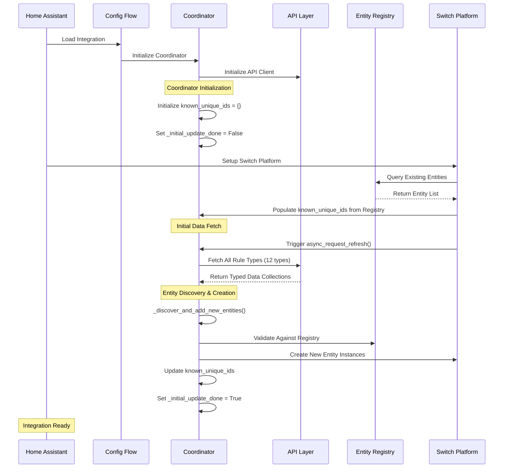

### Startup Phase Details

#### 1. Coordinator Initialization

```python
# Key initialization steps
self.known_unique_ids: Set[str] = set()  # Track all known entity IDs
self._initial_update_done: bool = False  # Prevent premature deletion checks
self.async_add_entities_callback = None  # Set by switch platform
```

#### 2. Registry Population

```python
# Populate known_unique_ids from Home Assistant entity registry
coordinator.known_unique_ids = { 
    entry.unique_id 
    for entry in entity_registry.entities.values()
    if entry.config_entry_id == config_entry.entry_id
    and entry.domain == "switch" 
    and entry.platform == DOMAIN 
    and entry.unique_id
}
```

#### 3. Initial Data Fetch

- Coordinator fetches all entity types using consistent API patterns
- Each entity type uses dedicated API method (e.g., `get_static_routes()`)
- Data is stored in typed collections (e.g., `self.static_routes: List[StaticRoute]`)

## Coordinator Architecture

The coordinator serves as the central orchestrator for all entity lifecycle operations, maintaining clean separation between UniFi-specific logic (API layer) and Home Assistant integration patterns.

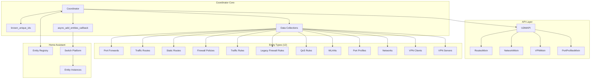

### Data Storage Patterns

All entity types follow consistent storage patterns in the coordinator:

```python
# Consistent attribute naming and typing
self.port_forwards: List[PortForward] = []
self.traffic_routes: List[TrafficRoute] = []
self.static_routes: List[StaticRoute] = []
self.firewall_policies: List[FirewallPolicy] = []
self.traffic_rules: List[TrafficRule] = []
self.legacy_firewall_rules: List[FirewallRule] = []
self.qos_rules: List[QoSRule] = []
self.wlans: List[Wlan] = []
self.port_profiles: List[PortProfile] = []
self.networks: List[NetworkConf] = []
self.vpn_clients: List[VPNConfig] = []
self.vpn_servers: List[VPNConfig] = []
```

## Entity Discovery Patterns

Entity discovery follows a unified pattern for all entity types, ensuring consistency and preventing architectural debt.

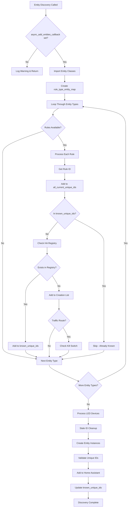

### Discovery Implementation Pattern

All entity types use this consistent pattern:

```python
# Unified discovery pattern for ALL entity types
rule_type_entity_map = [
    ("port_forwards", UnifiPortForwardSwitch),
    ("traffic_rules", UnifiTrafficRuleSwitch),
    ("firewall_policies", UnifiFirewallPolicySwitch),
    ("traffic_routes", UnifiTrafficRouteSwitch),
    ("static_routes", UnifiStaticRouteSwitch),
    ("legacy_firewall_rules", UnifiLegacyFirewallRuleSwitch), 
    ("qos_rules", UnifiQoSRuleSwitch),
    ("wlans", UnifiWlanSwitch),
    ("port_profiles", UnifiPortProfileSwitch),
    ("networks", UnifiNetworkSwitch),
    ("vpn_clients", UnifiVPNClientSwitch),
    ("vpn_servers", UnifiVPNServerSwitch),
]

for rule_type_key, entity_class in rule_type_entity_map:
    rules = new_data.get(rule_type_key, [])
    for rule in rules:
        rule_id = get_rule_id(rule)
        all_current_unique_ids.add(rule_id)
        
        if rule_id not in self.known_unique_ids:
            # Registry validation prevents duplicates
            existing_entity_id = entity_registry.async_get_entity_id("switch", DOMAIN, rule_id)
            
            if existing_entity_id:
                self.known_unique_ids.add(rule_id)
            else:
                potential_entities_data[rule_id] = {
                    "rule_data": rule,
                    "rule_type": rule_type_key,
                    "entity_class": entity_class,
                }
```

## Smart Polling Lifecycle

Smart polling provides efficient change detection while maintaining entity lifecycle integrity.

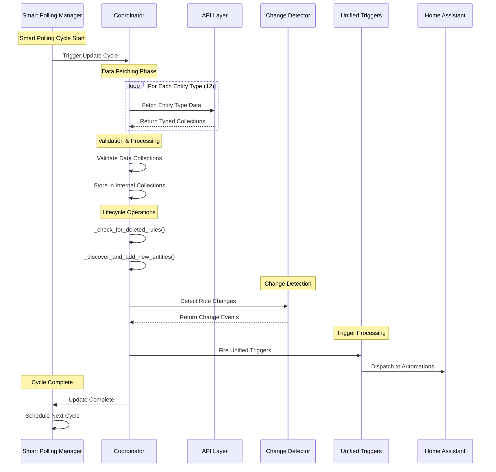

### Smart Polling Data Flow

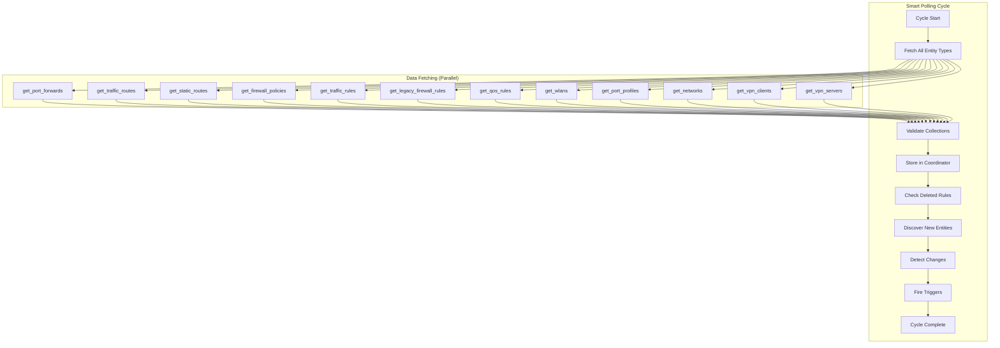

## Change Detection & Unified Triggers

The unified trigger system provides consistent automation integration across all entity types.

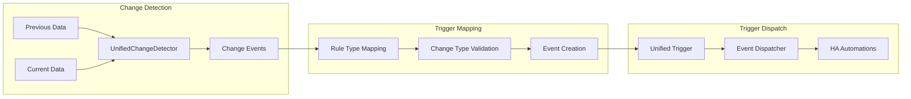

### Change Type Mapping

```python
# Consistent change type mapping for all entity types
_rule_type_mapping = {
    "port_forwards": "port_forward",
    "traffic_routes": "traffic_route", 
    "static_routes": "route",           # Maps to "route" change_type
    "firewall_policies": "firewall_policy",
    "traffic_rules": "traffic_rule",
    "legacy_firewall_rules": "firewall_policy",
    "firewall_zones": "firewall_zone",
    "wlans": "wlan",
    "qos_rules": "qos_rule",
    "vpn_clients": "vpn_client",
    "vpn_servers": "vpn_server",
    "devices": "device",
    "port_profiles": "port_profile",
    "networks": "network",
}

# Valid change types for unified triggers
VALID_CHANGE_TYPES = [
    "firewall_policy", "traffic_rule", "traffic_route", "port_forward",
    "firewall_zone", "wlan", "qos_rule", "vpn_client", "vpn_server",
    "device", "port_profile", "network", "route"
]
```

## Entity Cleanup & Deletion

Entity cleanup follows a precise algorithm to prevent premature deletion while ensuring stale entities are removed.

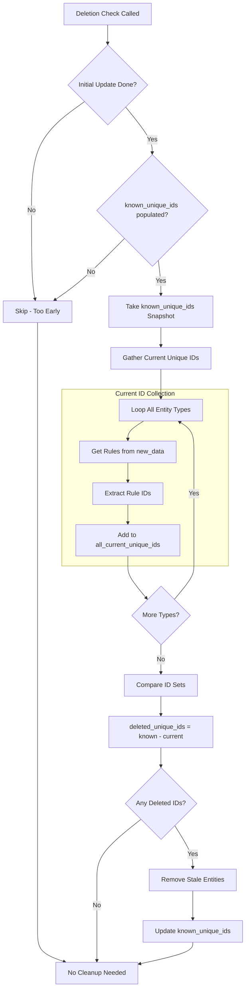

### Deletion Algorithm

```python
def _check_for_deleted_rules(self, new_data: Dict[str, List[Any]]) -> None:
    """Check for rules previously known but not in the new data, and trigger their removal."""
    
    # Safety checks - prevent premature deletion
    if not self._initial_update_done or not self.known_unique_ids:
        return
    
    # Take snapshot to prevent concurrent modification
    current_known_ids = set(self.known_unique_ids)
    
    # Gather ALL unique IDs present in current data
    all_current_unique_ids = set()
    all_rule_sources_types = [
        "port_forwards", "traffic_routes", "static_routes", "firewall_policies",
        "traffic_rules", "legacy_firewall_rules", "qos_rules", "wlans",
        "vpn_clients", "vpn_servers", "port_profiles", "networks"
    ]
    
    for rule_type in all_rule_sources_types:
        rules = new_data.get(rule_type, [])
        for rule in rules:
            rule_id = get_rule_id(rule)
            if rule_id:
                all_current_unique_ids.add(rule_id)
                # Special handling for kill switches
                if rule_type == "traffic_routes" and "kill_switch_enabled" in rule.raw:
                    kill_switch_id = get_child_unique_id(rule_id, "kill_switch")
                    all_current_unique_ids.add(kill_switch_id)
    
    # Find IDs that are known but NOT in current data
    deleted_unique_ids = current_known_ids - all_current_unique_ids
    
    # Process deletions
    if deleted_unique_ids:
        self.known_unique_ids -= deleted_unique_ids
        for stale_id in deleted_unique_ids:
            self.hass.async_create_task(self._remove_entity_async(stale_id))
```

## API Layer Architecture

The API layer encapsulates all UniFi-specific complexity, providing clean interfaces to the coordinator.

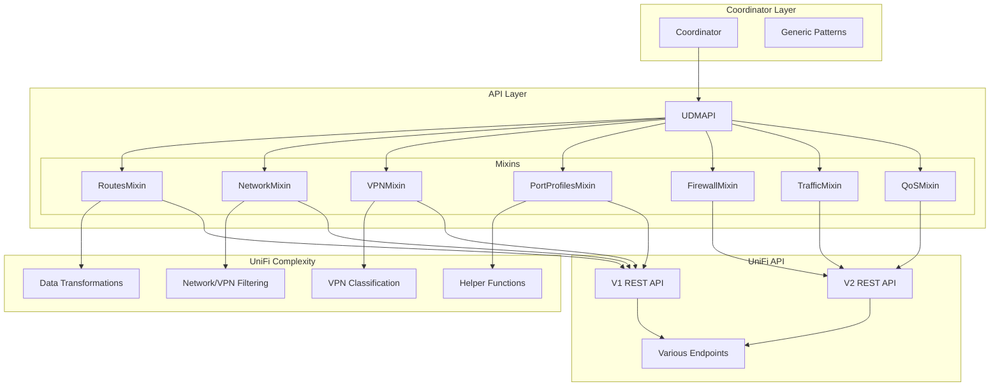

### API Method Patterns

All API methods follow consistent patterns:

```python
# 1:1 mapping between coordinator calls and API methods
await self._update_rule_type_in_dict(data, "static_routes", self.api.get_static_routes)
await self._update_rule_type_in_dict(data, "networks", self.api.get_networks)
await self._update_rule_type_in_dict(data, "vpn_clients", self.api.get_vpn_clients)
await self._update_rule_type_in_dict(data, "vpn_servers", self.api.get_vpn_servers)

# Generic pattern for simple rule types
async def _update_rule_type_in_dict(self, data: Dict[str, List[Any]], rule_type: str, api_method) -> None:
    """Generic method to update rule types in the data dictionary."""
    try:
        future = await self.api.queue_api_operation(api_method)
        rules = await future if hasattr(future, "__await__") else future
        data[rule_type] = rules or []
        setattr(self, rule_type, data[rule_type])
    except Exception as err:
        LOGGER.error("Failed to update %s: %s", rule_type, err)
        data[rule_type] = []
```

### Data Filtering Examples

```python
# Networks: Filter out VPNs and defaults in API layer
async def get_networks(self) -> List[NetworkConf]:
    """Get manageable network configurations (excludes VPNs and default network)."""
    all_networks = await self._fetch_all_network_configs()
    return filter_switchable_networks(all_networks)  # Uses helper functions

# VPNs: Explicit classification in API layer  
async def get_vpn_clients(self) -> List[VPNConfig]:
    """Get VPN client connections."""
    all_networks = await self._fetch_all_network_configs() 
    vpn_configs = []
    for network in all_networks:
        if is_vpn_network(network):  # Uses helper function
            is_client, is_server = classify_vpn_type(purpose, vpn_type)
            if is_client:
                vpn_configs.append(VPNConfig(network))
    return vpn_configs
```

## Registry Validation Patterns

Registry validation prevents duplicate entity creation and ensures consistency with Home Assistant's entity registry.

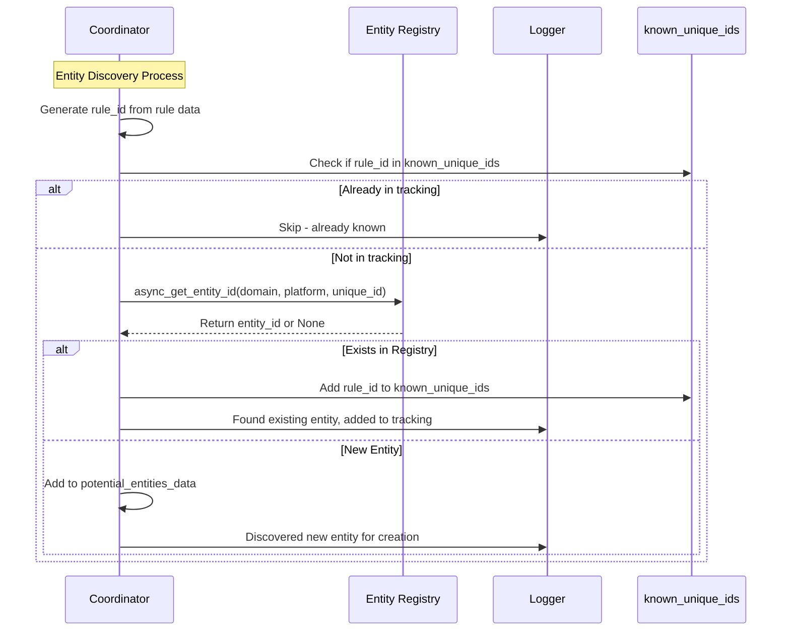

### Validation Implementation

```python
# Registry validation pattern used for ALL entity types
if rule_id not in self.known_unique_ids:
    # Check if entity already exists in Home Assistant registry
    entity_registry = async_get_entity_registry(self.hass)
    existing_entity_id = entity_registry.async_get_entity_id("switch", DOMAIN, rule_id)
    
    if existing_entity_id:
        # Entity exists in registry but not in our tracking - add to known_unique_ids
        LOGGER.debug("Found existing entity in registry: %s, adding to tracking", rule_id)
        self.known_unique_ids.add(rule_id)
    else:
        # Truly new entity - add to potential creation list
        potential_entities_data[rule_id] = {
            "rule_data": rule,
            "rule_type": rule_type_key,
            "entity_class": entity_class,
        }
        LOGGER.debug("Discovered potential new entity: %s (%s)", rule_id, rule_type_key)
```

## Error Handling & Recovery

The integration implements robust error handling with graceful degradation and recovery mechanisms.

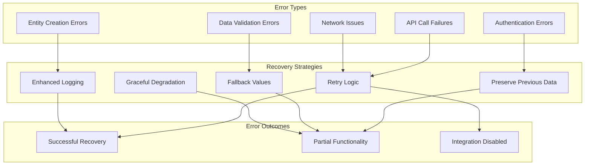

### Error Handling Patterns

```python
# Authentication failure handling
if auth_failure_during_update:
    LOGGER.warning("Authentication issues detected - preserving existing data")
    for key in ["port_forwards", "firewall_policies", "traffic_rules", "traffic_routes", "static_routes"]:
        if not rules_data[key] and previous_data and key in previous_data:
            LOGGER.info("Preserving previous %s data due to authentication issues", key)
            rules_data[key] = previous_data[key]

# API call error handling with fallback
async def _update_rule_type_in_dict(self, data: Dict[str, List[Any]], rule_type: str, api_method) -> None:
    """Generic method to update rule types with error handling."""
    try:
        future = await self.api.queue_api_operation(api_method)
        rules = await future if hasattr(future, "__await__") else future
        data[rule_type] = rules or []
        setattr(self, rule_type, data[rule_type])
    except Exception as err:
        LOGGER.error("Failed to update %s: %s", rule_type, err)
        data[rule_type] = []  # Fallback to empty list
        if not hasattr(self, rule_type):
            setattr(self, rule_type, [])  # Ensure attribute exists
```

## Data Flow Architecture

The complete data flow from UniFi API through the coordinator to Home Assistant entities.

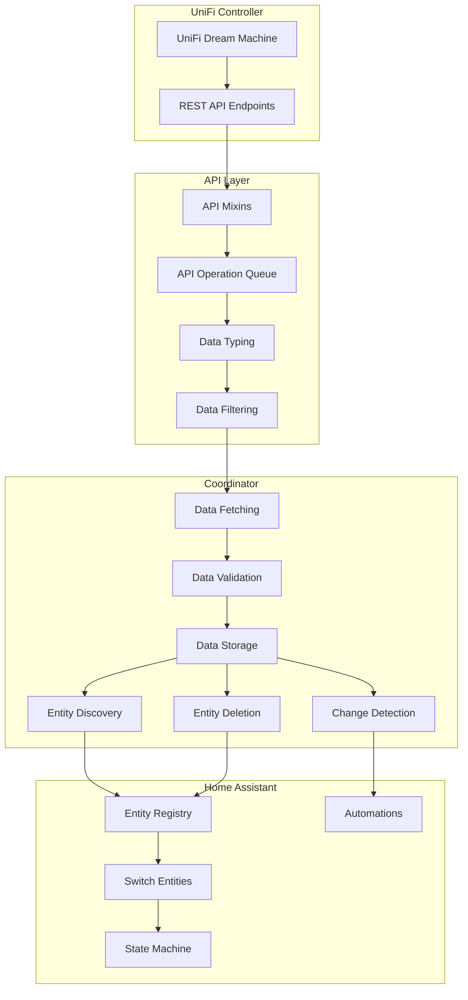

### Data Transformation Pipeline

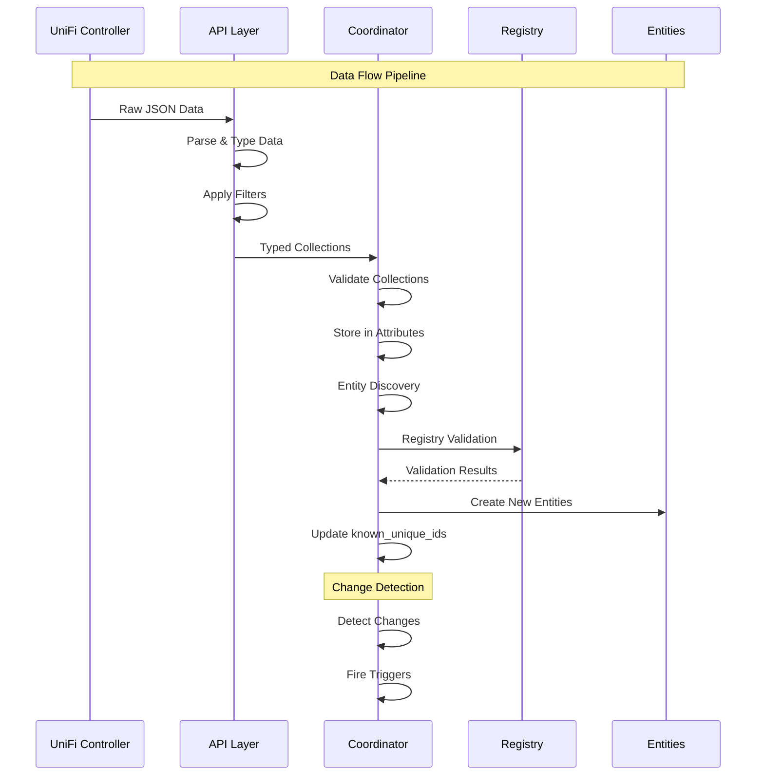

## Implementation Guidelines

### Adding New Entity Types

To add a new entity type following these patterns:

1. **Create API Method**

   ```python
   async def get_new_rule_type(self) -> List[NewRuleType]:
       """Get new rule type with proper typing and error handling."""
       # Follow established patterns
   ```

2. **Add to Coordinator**

   ```python
   # Add to data fetching
   await self._update_rule_type_in_dict(rules_data, "new_rule_type", self.api.get_new_rule_type)
   
   # Add to coordinator attributes
   self.new_rule_type: List[NewRuleType] = []
   ```

3. **Create Switch Class**

   ```python
   class UnifiNewRuleTypeSwitch(UnifiRuleSwitch):
       """Switch for new rule type following established patterns."""
   ```

4. **Add to Discovery**

   ```python
   # Add to rule_type_entity_map
   ("new_rule_type", UnifiNewRuleTypeSwitch),
   
   # Add to deletion check types
   "new_rule_type",
   ```

5. **Add to Change Detection**

   ```python
   # Add to rule type mapping
   "new_rule_type": "new_rule",
   
   # Add to valid change types
   "new_rule",
   ```

### Critical Patterns to Follow

1. **Always use registry validation** for entity creation
2. **Follow 1:1 mapping** between API calls and data collections  
3. **Include in all lifecycle phases** (discovery, deletion, change detection)
4. **Use consistent error handling** with fallback values
5. **Maintain type safety** throughout the pipeline
6. **Test entity lifecycle** thoroughly including deletion scenarios

### Common Pitfalls to Avoid

1. **❌ Special case handling** - Use generic patterns for all entity types
2. **❌ Missing from discovery mapping** - Entities won't be tracked properly
3. **❌ Skipping registry validation** - Causes duplicate entity errors
4. **❌ Inconsistent naming** - Use established attribute naming patterns
5. **❌ Missing error handling** - Always provide fallback behavior
6. **❌ Entity deletion before initial_update_done** - Causes premature cleanup

## Conclusion

This architecture provides a robust, maintainable foundation for entity lifecycle management in the UniFi Network Rules integration. By following these patterns consistently, all entity types receive identical treatment while maintaining clean separation of concerns between UniFi-specific logic and Home Assistant integration patterns.

The patterns documented here resolve critical lifecycle bugs, prevent architectural debt, and provide a clear path for future development. All entity types - from port forwards to static routes to VPN configurations - follow identical discovery, creation, and deletion patterns, ensuring long-term maintainability and reliability.
